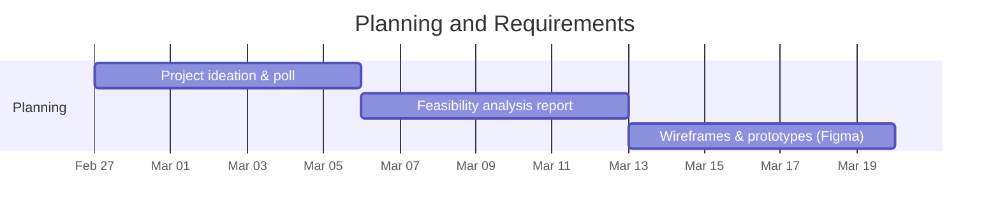
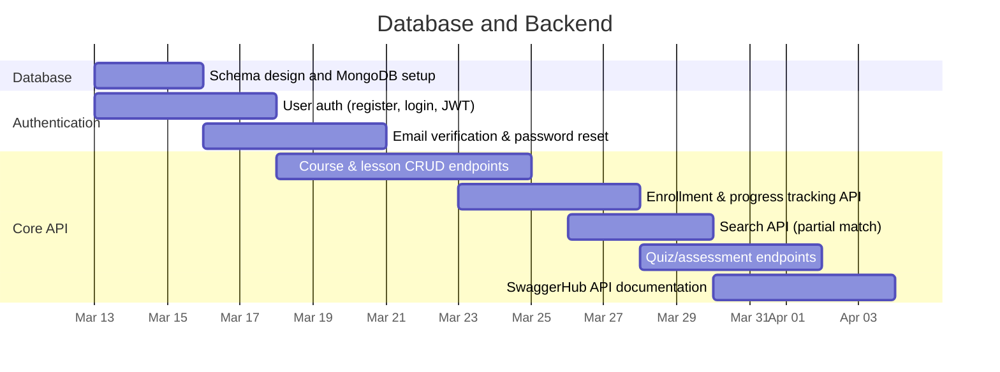
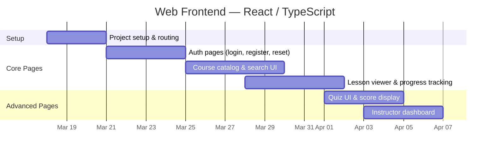
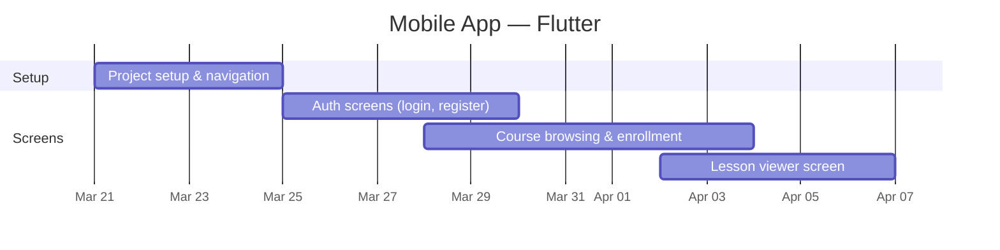
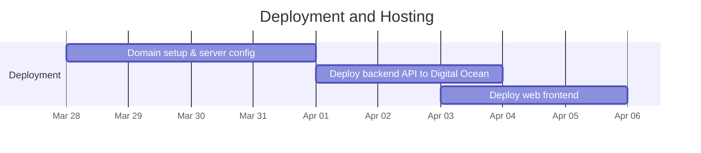
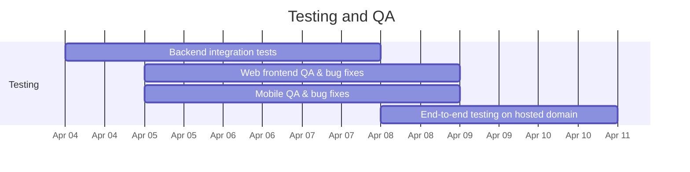
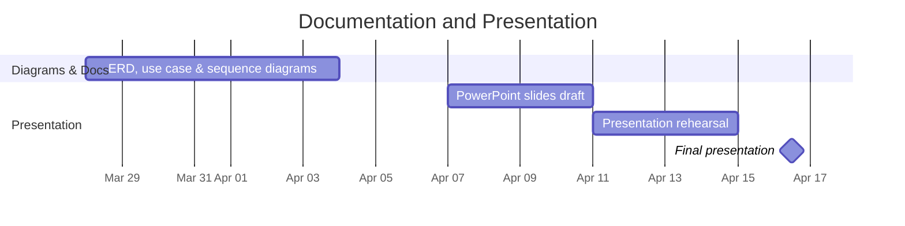

# 📅 Project Gantt Chart — Educational CMS with API
**COP 4331 — Spring 2026**  
**Target Presentation Date: April 16, 2026**

---

## Gantt Charts by Phase

> Each phase has its own chart for better readability. All charts render automatically on GitHub.

---

### 🗂️ Phase 1 — Planning & Requirements

---

### 🗄️ Phase 2 — Database & Backend

---

### 🌐 Phase 3 — Web Frontend (React / TypeScript)

---

### 📱 Phase 4 — Mobile App (Flutter)

---

### 🚀 Phase 5 — Deployment & Hosting

---

### 🧪 Phase 6 — Testing & QA

---

### 🎤 Phase 7 — Documentation & Presentation

---

## 📋 Task Breakdown Table

| # | Phase | Task | Start | End | Status | Notes |
|---|-------|------|-------|-----|--------|-------|
| 1 | Planning | Project ideation & team poll | Feb 27 | Mar 6 | ✅ Done | Voted on Discord |
| 2 | Planning | Feasibility analysis report | Mar 6 | Mar 13 | ✅ Done | Submitted individually |
| 3 | Database | Schema design & MongoDB setup | Mar 13 | Mar 13 | ✅ Done | Remote DB on MongoDB Atlas |
| 4 | Backend | User auth — register, login, JWT | Mar 13 | Mar 18 | 🔄 In Progress | |
| 5 | Backend | Email verification & password reset | Mar 16 | Mar 21 | ⬜ To Do | Use SendGrid or NodeMailer |
| 6 | UI/UX | Wireframes & prototypes (Figma) | Mar 13 | Mar 20 | ⬜ To Do | Required for grading rubric |
| 7 | Web | Project setup, routing, TypeScript config | Mar 18 | Mar 21 | ⬜ To Do | Vite + React + TS |
| 8 | Backend | Course & lesson CRUD endpoints | Mar 18 | Mar 25 | ⬜ To Do | |
| 9 | Web | Auth pages (login, register, reset) | Mar 21 | Mar 25 | ⬜ To Do | |
| 10 | Mobile | Flutter project setup & navigation | Mar 21 | Mar 25 | ⬜ To Do | |
| 11 | Backend | Enrollment & progress tracking API | Mar 23 | Mar 28 | ⬜ To Do | |
| 12 | Web | Course catalog & search UI | Mar 25 | Mar 30 | ⬜ To Do | |
| 13 | Mobile | Auth screens (login, register) | Mar 25 | Mar 30 | ⬜ To Do | |
| 14 | Backend | Search API with partial match | Mar 26 | Mar 30 | ⬜ To Do | Required for grading — query server, partial text |
| 15 | Backend | Quiz / assessment endpoints | Mar 28 | Apr 2 | ⬜ To Do | |
| 16 | Web | Lesson viewer & progress UI | Mar 28 | Apr 2 | ⬜ To Do | |
| 17 | Mobile | Course browsing & enrollment screens | Mar 28 | Apr 4 | ⬜ To Do | |
| 18 | Deployment | Domain name setup & server config | Mar 28 | Apr 1 | ⬜ To Do | Digital Ocean recommended |
| 19 | Docs | ERD, use case & sequence diagrams | Mar 28 | Apr 4 | ⬜ To Do | Required for slides rubric |
| 20 | Backend | SwaggerHub API documentation | Mar 30 | Apr 4 | ⬜ To Do | At least 1, max 2 endpoints |
| 21 | Web | Quiz UI & score display | Apr 1 | Apr 5 | ⬜ To Do | |
| 22 | Deployment | Deploy backend API to Digital Ocean | Apr 1 | Apr 4 | ⬜ To Do | |
| 23 | Web | Instructor dashboard | Apr 3 | Apr 7 | ⬜ To Do | |
| 24 | Deployment | Deploy web frontend | Apr 3 | Apr 6 | ⬜ To Do | Must be accessible via domain name |
| 25 | Mobile | Lesson viewer screen | Apr 2 | Apr 7 | ⬜ To Do | |
| 26 | Testing | Backend integration tests | Apr 4 | Apr 8 | ⬜ To Do | Required: unit & integration test results in slides |
| 27 | Testing | Web frontend QA & bug fixes | Apr 5 | Apr 9 | ⬜ To Do | |
| 28 | Testing | Mobile QA & bug fixes | Apr 5 | Apr 9 | ⬜ To Do | |
| 29 | Testing | End-to-end test on hosted domain | Apr 8 | Apr 11 | ⬜ To Do | ⚠️ Check on UCF campus network 2 days before |
| 30 | Presentation | PowerPoint slides draft | Apr 7 | Apr 11 | ⬜ To Do | See slide requirements below |
| 31 | Presentation | Presentation rehearsal | Apr 11 | Apr 15 | ⬜ To Do | Stay under 15 min — 16+ min = penalty |
| 32 | Presentation | **Final presentation** | **Apr 16** | **Apr 16** | 🎯 Target | Add project to signup spreadsheet beforehand |

---

## ⚠️ Critical Reminders

| Item | Detail |
|------|--------|
| **Domain name** | Must use a domain name — IP addresses are **not acceptable** |
| **Campus network check** | Test the live URL on UCF Wi-Fi **2 days before** and **1 day before** presentation |
| **Presentation length** | Hard limit of **15 minutes** — exceeding 16 min = 5-point penalty |
| **Signup spreadsheet** | Add project title, GitHub URL, and live URL **before** presenting |
| **Bring a USB drive** | No time to retrieve files from cloud storage during the presentation |
| **All members must present** | Each member must explain a meaningful portion — missing = zero |
| **Slides due on time** | Submit PowerPoint to WebCourses on time (5 points) |

---

## 📊 Grading Rubric Checklist

| Points | Item | Owner | Status |
|--------|------|-------|--------|
| 5 pts | PowerPoint submitted on time | All | ⬜ |
| 5 pts | Professional PowerPoint slides | All | ⬜ |
| 5 pts | Gantt chart | All | ⬜ |
| 5 pts | Use case diagram | | ⬜ |
| 5 pts | Activity or Sequence diagram | | ⬜ |
| 5 pts | Email verification & password reset | | ⬜ |
| 5 pts | SwaggerHub API demo (1–2 endpoints) | | ⬜ |
| 5 pts | Effective server-side search (partial match) | | ⬜ |
| 5 pts | Prototypes / Wireframes | | ⬜ |
| 20 pts | Working demo — web **and** mobile | All | ⬜ |
| 5 pts | Adherence to current standards | All | ⬜ |
| 5 pts | ERD | | ⬜ |
| 5 pts | Explanation of technology | All | ⬜ |
| 5 pts | Instructor discretionary excellence | All | ⬜ |
| 10 pts | GitHub activity (commits, reviews, docs) | All | 🔄 Ongoing |
| 5 pts | Team evaluation of individual contribution | All | ⬜ |
| **100 pts** | **Total** | | |

---

## 🗂️ Required Slides Checklist

- [ ] Title page (project name & description)
- [ ] Team members and their individual contributions
- [ ] Technologies used (MongoDB, Express, React/TS, Flutter, Node.js, JWT, SendGrid, etc.)
- [ ] Things that went well
- [ ] Things that did not go well
- [ ] Gantt chart
- [ ] ERD
- [ ] Use case diagram
- [ ] Class diagram (for the Flutter mobile app)
- [ ] Sequence or Activity diagram
- [ ] Unit and integration test results
- [ ] Prototypes / Wireframes (Figma or Adobe XD)
- [ ] SwaggerHub API demonstration
- [ ] Live app demonstration (web + mobile)
- [ ] Time for questions

---

*Last updated: March 13, 2026*