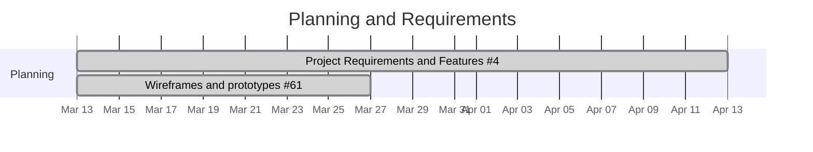
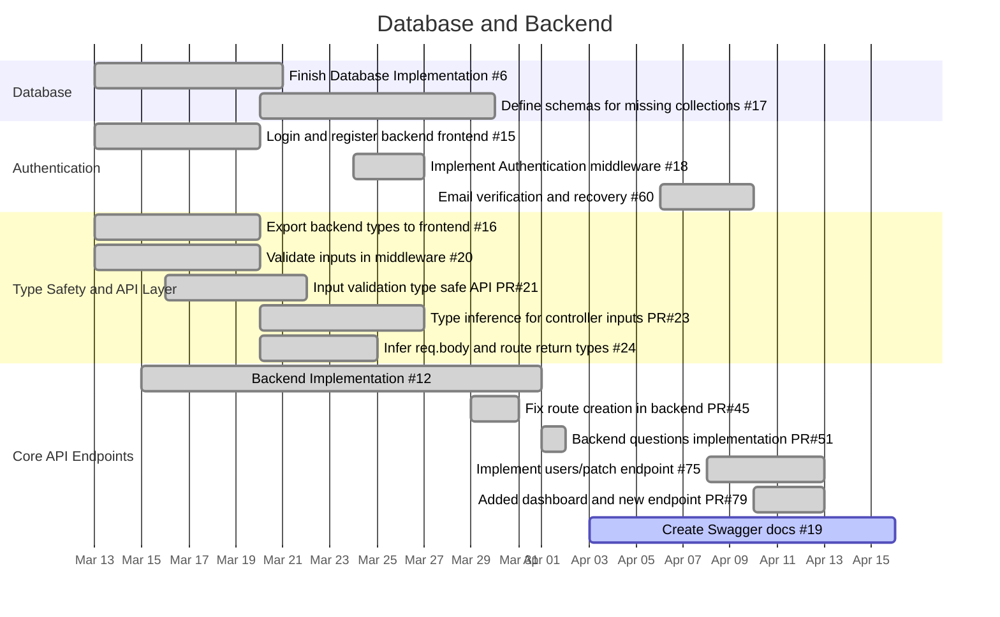
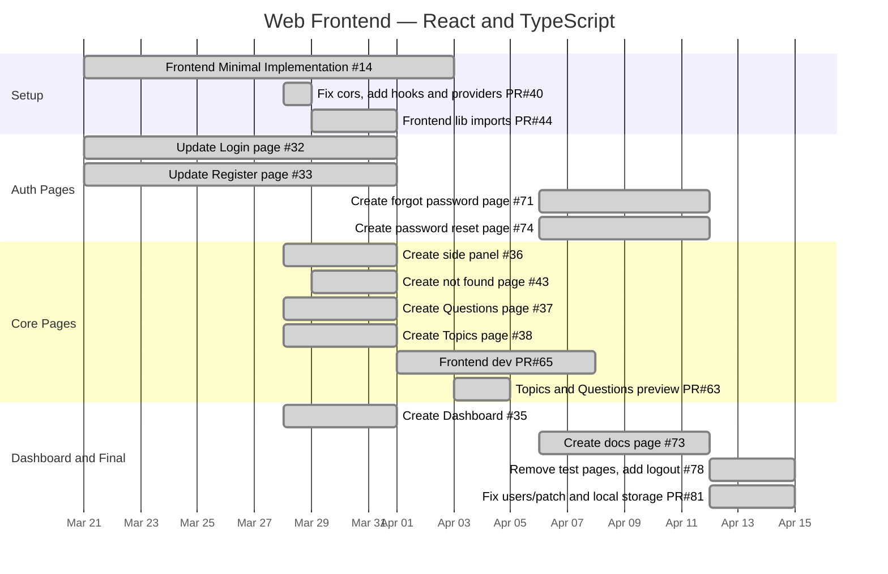
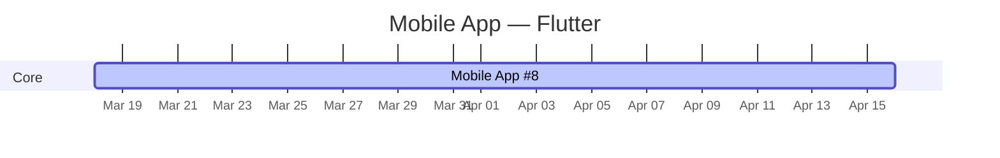
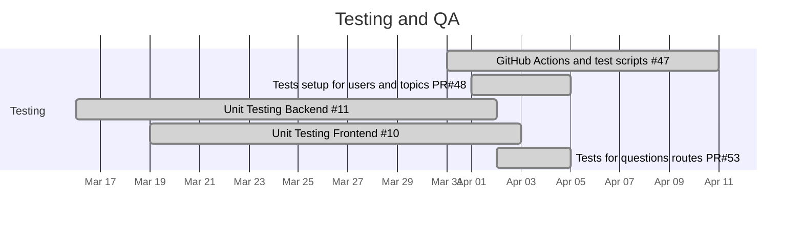

# 📅 Project Gantt Chart — EduCMS
**COP 4331 — Object-Oriented Software Development — Spring 2026**  
**Target Presentation Date: April 16, 2026**  
**Last updated: April 14, 2026**
 
---
 
## Legend
 
| Symbol | Meaning |
|--------|---------|
| ✅ Done | Completed and merged |
| 🔄 In Progress | Actively being worked on |
| ⬜ To Do | Not yet started |
| 🎯 Milestone | Deadline / presentation |
 
---
 
## Gantt Charts by Phase
 
---
 
### 🗂️ Phase 1 — Planning and Requirements
 

 
---
 
### 🗄️ Phase 2 — Database and Backend
 

 
---
 
### 🌐 Phase 3 — Web Frontend (React and TypeScript)
 

 
---
 
### 📱 Phase 4 — Mobile App (Flutter)
 

 
---
 
### 🧪 Phase 5 — Testing
 

 
---
 
### 🎤 Phase 6 — Documentation and Presentation
 
```mermaid
gantt
    title Documentation and Presentation
    dateFormat  YYYY-MM-DD
    axisFormat  %b %d
 
    section Docs
    Update README.md #22                   :done,   doc1, 2026-03-20, 2026-04-14
    Use Case Diagram #58                   :done,   doc2, 2026-04-01, 2026-04-09
    Activity or Sequence Diagram #59       :done,   doc3, 2026-04-01, 2026-04-10
    ERD #62                                :done,   doc4, 2026-04-06, 2026-04-12
    Gantt Chart #57                        :done,   doc5, 2026-04-01, 2026-04-14
    Software usage documentation #69       :active, doc6, 2026-04-10, 2026-04-16
    Create Swagger docs #19                :active, doc7, 2026-04-03, 2026-04-16
 
    section Presentation
    Project Presentation #13               :active, ppt1, 2026-03-27, 2026-04-16
    Final presentation                     :milestone, pres, 2026-04-16, 1d
```
 
---
 
## 📋 Task Breakdown Table
 
> Source: GitHub Project Board — exported April 14, 2026.
 
| Issue | Title | Assignee(s) | Status | PR(s) |
|-------|-------|-------------|--------|-------|
| #4 | Project Requirements & Features | gimcastro, joe-ervin05, JYSCN, LuizGomes56, macolmenares18, tales888 | ✅ Done | — |
| #6 | Finish Database Implementation | gimcastro, joe-ervin05, LuizGomes56 | ✅ Done | — |
| #8 | Mobile App | gimcastro, joe-ervin05, macolmenares18, tales888 | 🔄 In Progress | — |
| #9 | Website App | JYSCN, LuizGomes56 | ✅ Done (11/11) | — |
| #10 | Unit Testing Frontend | JYSCN, macolmenares18 | ✅ Done | PR#53 |
| #11 | Unit Testing Backend | JYSCN | ✅ Done | PR#53 |
| #12 | Backend Implementation | LuizGomes56 | ✅ Done | PR#53 |
| #13 | Project Presentation | gimcastro, joe-ervin05, macolmenares18, tales888 | 🔄 In Progress | — |
| #14 | Frontend Minimal Implementation | joe-ervin05 | ✅ Done | PR#40 |
| #15 | Login register backend frontend | LuizGomes56 | ✅ Done | — |
| #16 | Export backend to frontend as type declaration library | gimcastro | ✅ Done | PR#23, PR#26, PR#28 |
| #17 | Define schemas for missing database collections | joe-ervin05, JYSCN, LuizGomes56 | ✅ Done | — |
| #18 | Implement Authentication middleware | gimcastro, LuizGomes56 | ✅ Done | PR#27, PR#41 |
| #19 | Create Swagger docs | gimcastro, joe-ervin05, macolmenares18, tales888 | ⬜ To Do | — |
| #20 | Validate inputs in middleware, dynamically | — | ✅ Done | PR#21 |
| #22 | Update README.md with current progress | gimcastro, joe-ervin05, macolmenares18, tales888 | ✅ Done | PR#31 |
| #24 | Automatically infer req.body and route return types | LuizGomes56 | ✅ Done | PR#23 |
| #32 | Update Login page | gimcastro, joe-ervin05, macolmenares18 | ✅ Done | — |
| #33 | Update Register page | gimcastro, joe-ervin05, macolmenares18 | ✅ Done | — |
| #34 | Create reset password page | JYSCN, LuizGomes56 | ✅ Done | PR#77 |
| #35 | Create Dashboard | JYSCN, LuizGomes56 | ✅ Done | PR#79 |
| #36 | Create a side panel | gimcastro, joe-ervin05, macolmenares18 | ✅ Done | PR#44 |
| #37 | Create Questions page | JYSCN, LuizGomes56 | ✅ Done | PR#49, PR#65 |
| #38 | Create Topics page | gimcastro, joe-ervin05, macolmenares18 | ✅ Done | PR#63 |
| #43 | Create not found page | — | ✅ Done | PR#44 |
| #47 | GitHub Actions and test scripts design | JYSCN, LuizGomes56 | ✅ Done | PR#51 |
| #57 | Gantt Chart | gimcastro, joe-ervin05, macolmenares18, tales888 | ✅ Done | PR#76 |
| #58 | Use Case Diagram | gimcastro | ✅ Done | PR#64 |
| #59 | Activity or Sequence Diagram | gimcastro, joe-ervin05, macolmenares18, tales888 | ✅ Done | PR#68 |
| #60 | Email verification and recovery | JYSCN, LuizGomes56 | ✅ Done (1/1) | PR#70 |
| #61 | Prototypes / Flow chart | gimcastro, joe-ervin05, macolmenares18, tales888 | ⬜ To Do | — |
| #62 | ERD — Generate through MongoDB | gimcastro, joe-ervin05, macolmenares18, tales888 | ⬜ To Do | — |
| #67 | Email verification | — | ✅ Done | PR#66 |
| #69 | Software usage training/documentation | gimcastro, joe-ervin05, macolmenares18, tales888 | ⬜ To Do | — |
| #71 | Create forgot password page | JYSCN, LuizGomes56 | ✅ Done | PR#77 |
| #73 | Create docs page | LuizGomes56 | ✅ Done | PR#77 |
| #74 | Create password reset page | JYSCN, LuizGomes56 | ✅ Done | PR#77 |
| #75 | Implement users/patch (Backend) | JYSCN, LuizGomes56 | ✅ Done | PR#79 |
| #78 | Add logout button, remove test pages | JYSCN, LuizGomes56 | ✅ Done | PR#81 |
 
---
 
## ⚠️ Critical Reminders
 
| Item | Detail |
|------|--------|
| **Domain name** | Must use a domain name — IP addresses are **not acceptable** |
| **Campus network check** | Test the live URL on UCF Wi-Fi **before** presentation |
| **Presentation length** | Hard limit of **15 minutes** — exceeding 16 min = 5-point penalty |
| **Signup spreadsheet** | Add project title, GitHub URL, and live URL **before** presenting |
| **Bring a USB drive** | No time to retrieve files from cloud storage during presentation |
| **All members must present** | Each member must explain a meaningful portion — missing = zero |
| **Slides due on time** | Submit PowerPoint to WebCourses on time — 5 points |
 
---
 
## 📊 Grading Rubric Checklist
 
| Points | Item | Owner | Status |
|--------|------|-------|--------|
| 5 pts | PowerPoint submitted on time | All | ⬜ To Do |
| 5 pts | Professional PowerPoint slides | macolmenares18 | 🔄 In Progress (#13) |
| 5 pts | Gantt chart | All | ✅ Done (#57) |
| 5 pts | Use case diagram | gimcastro | ✅ Done (#58) |
| 5 pts | Activity or Sequence diagram | All | ✅ Done (#59) |
| 5 pts | Email verification and password reset | JYSCN, LuizGomes56 | ✅ Done (#60) |
| 5 pts | SwaggerHub API demo (1–2 endpoints) | All | ⬜ To Do (#19) |
| 5 pts | Effective server-side search (partial match) | All | ⬜ To Do |
| 5 pts | Prototypes / Wireframes | All | 🔄 In Progress (#61) |
| 20 pts | Working demo — web **and** mobile | All | ✅ Done (#9, #8) |
| 5 pts | Adherence to current standards | All | ✅ Done |
| 5 pts | ERD | All | ⬜ To Do (#62) |
| 5 pts | Explanation of technology | All | 🔄 In Progress |
| 5 pts | Instructor discretionary excellence | All | — |
| 10 pts | GitHub activity (commits, reviews, docs) | All | 🔄 Ongoing |
| 5 pts | Team evaluation of individual contribution | All | — |
| **100 pts** | **Total** | | |
 
---
 
## 🗂️ Required Slides Checklist
 
- [ ] Gantt chart *(#57)*
- [ ] Prototypes / Wireframes *(#61)*
- [x] Title page (project name and description)
- [x] Team members and individual contributions
- [x] Technologies used (MongoDB, Express, React/TS, Flutter, Node.js, JWT, AWS SES)
- [ ] Things that went well
- [ ] Things that did not go well
- [ ] ERD *(#62)*
- [x] Use case diagram *(#58)*
- [ ] Class diagram (Flutter mobile app)
- [x] Activity or Sequence diagram *(#59)*
- [x] Unit and integration test results *(#11, #10, #47)*
- [ ] SwaggerHub API demonstration *(#19)*
- [ ] Live app demonstration — web and mobile *(#9, #8)*
- [ ] Time for questions