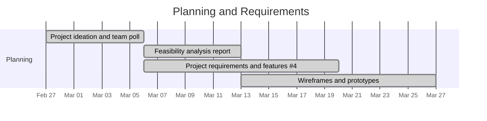
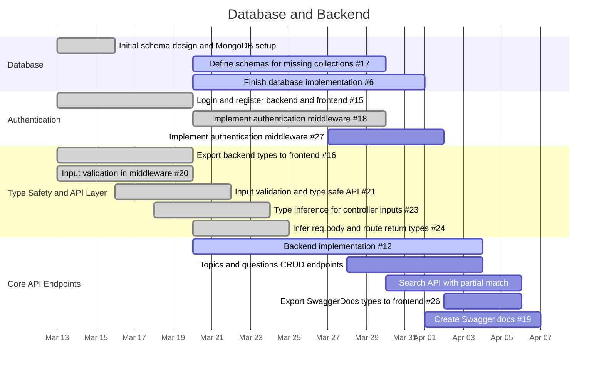
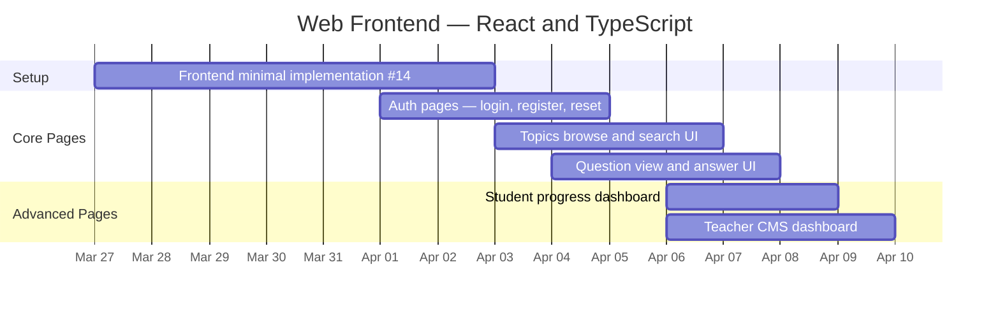
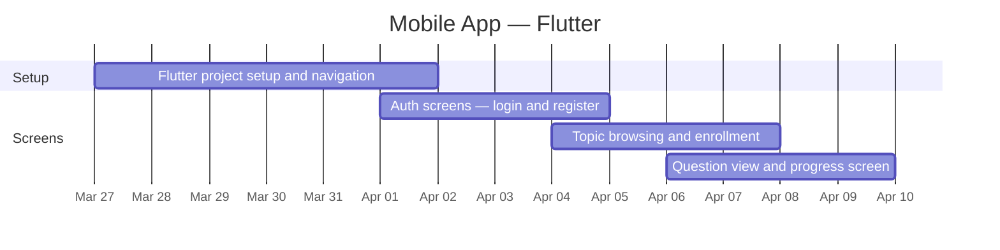
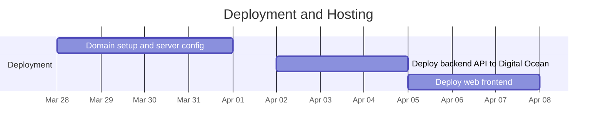
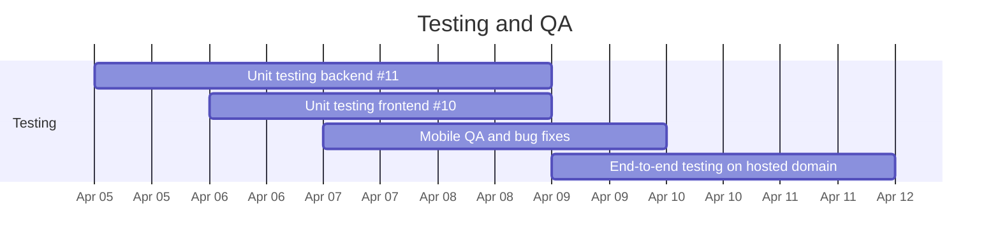
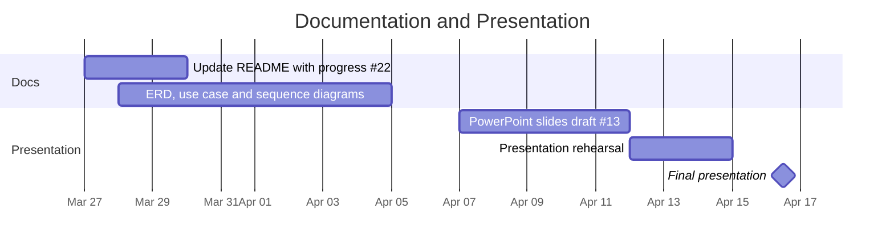

# 📅 Project Gantt Chart — EduCMS
**COP 4331 — Object-Oriented Software Development — Spring 2026**  
**Target Presentation Date: April 16, 2026**  
**Last updated: March 27, 2026**

---

## Legend

| Symbol | Meaning |
|--------|---------|
| ✅ Done | Completed and merged |
| 🔄 In Progress | Actively being worked on |
| 🚧 Blocked | In progress but blocked |
| ⬜ To Do | Not yet started |
| 🎯 Milestone | Deadline / presentation |

---

## Gantt Charts by Phase

> Each phase has its own chart for better readability. All charts render automatically on GitHub.

---

### 🗂️ Phase 1 — Planning and Requirements

---

### 🗄️ Phase 2 — Database and Backend

---

### 🌐 Phase 3 — Web Frontend (React and TypeScript)

---

### 📱 Phase 4 — Mobile App (Flutter)

---

### 🚀 Phase 5 — Deployment and Hosting

---

### 🧪 Phase 6 — Testing and QA

---

### 🎤 Phase 7 — Documentation and Presentation

---

## 📋 Task Breakdown Table

> Status reflects GitHub project board as of **March 27, 2026**.

| # | Issue | Phase | Task | Assignee(s) | Start | End | Status |
|---|-------|-------|------|-------------|-------|-----|--------|
| 1 | — | Planning | Project ideation and team poll | All | Feb 27 | Mar 6 | ✅ Done |
| 2 | — | Planning | Feasibility analysis report | All | Mar 6 | Mar 13 | ✅ Done |
| 3 | #4 | Planning | Project requirements and features | All | Mar 6 | Mar 20 | ✅ Done |
| 4 | — | UI/UX | Wireframes and prototypes | macolmenares18 | Mar 13 | Mar 27 | ✅ Done |
| 5 | — | Database | Initial schema design and MongoDB setup | joe-ervin05, tales888, JYSCN | Mar 13 | Mar 16 | ✅ Done |
| 6 | #15 | Backend | Login and register — backend and frontend | LuizGomes56 | Mar 13 | Mar 20 | ✅ Done |
| 7 | #16 | Backend | Export backend to frontend as type declaration library | gimcastro | Mar 13 | Mar 20 | ✅ Done |
| 8 | #20 | Backend | Validate inputs in middleware dynamically | — | Mar 13 | Mar 20 | ✅ Done |
| 9 | #21 | Backend | Input validation — ensure API is type safe | LuizGomes56 | Mar 16 | Mar 22 | ✅ Done |
| 10 | #23 | Backend | Type inference for controller input parameters (req.body) | — | Mar 18 | Mar 24 | ✅ Done |
| 11 | #24 | Backend | Automatically infer req.body and route return types | LuizGomes56 | Mar 20 | Mar 25 | ✅ Done |
| 12 | #17 | Database | Define schemas for missing database collections | joe-ervin05, JYSCN | Mar 20 | Mar 30 | 🔄 In Progress |
| 13 | #6 | Database | Finish database implementation | gimcastro, joe-ervin0 | Mar 20 | Apr 1 | 🔄 In Progress |
| 14 | #18 | Backend | Implement authentication middleware | gimcastro | Mar 20 | Mar 30 | 🔄 In Progress |
| 15 | #12 | Backend | Backend implementation | LuizGomes56 | Mar 20 | Apr 4 | 🚧 Blocked |
| 16 | #27 | Backend | Implement authentication middleware (follow-up) | — | Mar 27 | Apr 2 | 🔄 In Progress |
| 17 | #26 | Backend | Export SwaggerDocs types to frontend | — | Apr 2 | Apr 6 | ⬜ To Do |
| 18 | #19 | Backend | Create Swagger docs | tales888 | Apr 1 | Apr 7 | ⬜ To Do |
| 19 | #14 | Web | Frontend minimal implementation | joe-ervin05 | Mar 27 | Apr 3 | 🔄 In Progress |
| 20 | #9 | Web | Website App — full web frontend | joe-ervin05, macolmenares18 | Apr 1 | Apr 10 | ⬜ To Do |
| 21 | #8 | Mobile | Mobile App — Flutter | tales888, JYSCN | Mar 27 | Apr 10 | ⬜ To Do |
| 22 | — | Deployment | Domain setup and server config | — | Mar 28 | Apr 1 | ⬜ To Do |
| 23 | — | Deployment | Deploy backend API to Digital Ocean | — | Apr 2 | Apr 5 | ⬜ To Do |
| 24 | — | Deployment | Deploy web frontend | joe-ervin05, macolmenares18 | Apr 5 | Apr 8 | ⬜ To Do |
| 25 | #11 | Testing | Unit testing — backend | — | Apr 5 | Apr 9 | ⬜ To Do |
| 26 | #10 | Testing | Unit testing — frontend | joe-ervin05, macolmenares18 | Apr 6 | Apr 9 | ⬜ To Do |
| 27 | — | Testing | End-to-end testing on hosted domain | All | Apr 9 | Apr 12 | ⬜ To Do |
| 28 | #22 | Docs | Update README with current progress and planning | All | Mar 27 | Mar 30 | 🔄 In Progress |
| 29 | — | Docs | ERD, use case and sequence diagrams | — | Mar 28 | Apr 5 | ⬜ To Do |
| 30 | #13 | Presentation | Project presentation — PowerPoint slides | All | Apr 7 | Apr 12 | ⬜ To Do |
| 31 | — | Presentation | Presentation rehearsal | All | Apr 12 | Apr 15 | ⬜ To Do |
| 32 | — | Presentation | **Final presentation** | **All** | **Apr 16** | **Apr 16** | 🎯 Milestone |

---

## ⚠️ Critical Reminders

| Item | Detail |
|------|--------|
| **Domain name** | Must use a domain name — IP addresses are **not acceptable** |
| **Campus network check** | Test the live URL on UCF Wi-Fi **2 days before** and **1 day before** presentation |
| **Presentation length** | Hard limit of **15 minutes** — exceeding 16 min = 5-point penalty |
| **Signup spreadsheet** | Add project title, GitHub URL, and live URL **before** presenting |
| **Bring a USB drive** | No time to retrieve files from cloud storage during presentation |
| **All members must present** | Each member must explain a meaningful portion — missing = zero |
| **Slides due on time** | Submit PowerPoint to WebCourses on time — 5 points |

---

## 📊 Grading Rubric Checklist

| Points | Item | Owner | Status |
|--------|------|-------|--------|
| 5 pts | PowerPoint submitted on time | All | ⬜ |
| 5 pts | Professional PowerPoint slides | All | ⬜ |
| 5 pts | Gantt chart | All | 🔄 Ongoing |
| 5 pts | Use case diagram |All | ⬜ |
| 5 pts | Activity or Sequence diagram |All | ⬜ |
| 5 pts | Email verification and password reset | All| ⬜ |
| 5 pts | SwaggerHub API demo (1–2 endpoints) | All | ⬜ |
| 5 pts | Effective server-side search (partial match) | All| ⬜ |
| 5 pts | Prototypes / Wireframes | All | ✅ Done |
| 20 pts | Working demo — web **and** mobile | All | ⬜ |
| 5 pts | Adherence to current standards | All | ⬜ |
| 5 pts | ERD |All | ⬜ |
| 5 pts | Explanation of technology | All | ⬜ |
| 5 pts | Instructor discretionary excellence | All | ⬜ |
| 10 pts | GitHub activity (commits, reviews, docs) | All | 🔄 Ongoing |
| 5 pts | Team evaluation of individual contribution | All | ⬜ |
| **100 pts** | **Total** | | |

---

## 🗂️ Required Slides Checklist

- [x] Gantt chart *(this document)*
- [x] Prototypes / Wireframes
- [ ] Title page (project name and description)
- [ ] Team members and individual contributions
- [ ] Technologies used (MongoDB, Express, React/TS, Flutter, Node.js, JWT, SendGrid)
- [ ] Things that went well
- [ ] Things that did not go well
- [ ] ERD
- [ ] Use case diagram
- [ ] Class diagram (Flutter mobile app)
- [ ] Sequence or Activity diagram
- [ ] Unit and integration test results
- [ ] SwaggerHub API demonstration
- [ ] Live app demonstration — web and mobile
- [ ] Time for questions