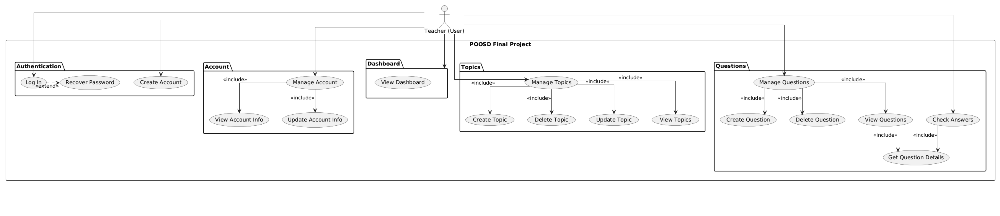

# 🎓 EduCMS — Educational Content Management System

**COP 4331 — Object-Oriented Software Development | Spring 2026 | University of Central Florida**

> A full-stack educational platform where instructors create and manage question banks organized by topic, and students browse, answer questions, and track their own progress.

---

## 👥 Team Members

| GitHub | Focus |
|--------|-------|
| [LuizGomes56](https://github.com/LuizGomes56) | Backend architecture, API type system, authentication |
| [gimcastro](https://github.com/gimcastro) | Database, middleware, authentication |
| [joe-ervin05](https://github.com/joe-ervin05) | Database schemas, Frontend pages |
| [macolmenares18](https://github.com/macolmenares18) | Frontend pages, Presentation |
| [JYSCN](https://github.com/JYSCN) | Frontend setup, routing, Mobile app (Flutter) |
| [tales888](https://github.com/tales888) | Mobile app (Flutter), Swagger documentation |

---

## 🔗 Links

| | URL |
|-|-----|
| 🌐 Live App | *(coming soon)* |
| 📄 Swagger API Docs | *(coming soon)* |
| 📋 Project Board | https://github.com/users/LuizGomes56/projects/1 |

---

## 🛠️ Tech Stack

| Layer | Technology |
|-------|-----------|
| **Database** | MongoDB (remote) |
| **Backend** | Node.js, Express 5, TypeScript |
| **Web Frontend** | React 19, TypeScript, Vite, Tailwind CSS v4 |
| **Mobile** | Flutter |
| **Auth** | JWT (JSON Web Tokens) + bcrypt |
| **Email** | SendGrid / NodeMailer *(in progress)* |
| **Validation** | Zod |
| **API Docs** | SwaggerHub |
| **Hosting** | Digital Ocean |

---

## 📊 Use Case Diagram



The diagram represents the main interactions between the user and the system, including account management, question and topic management, and answer checking.

## 📁 Repository Structure

```
poosd_final_project/
├── backend/                   # Express REST API — TypeScript
│   ├── src/
│   │   ├── controllers/       # users_controller, questions_controller, topics_controller
│   │   ├── model/             # Mongoose schemas (users, questions, topics)
│   │   ├── routes/            # Express routers + auto-generated methods.ts
│   │   └── utils/             # middleware, http builder, Zod validation
│   ├── nodemon.json
│   ├── package.json
│   └── tsconfig.json
│
├── frontend/                  # React + TypeScript web app
│   ├── public/                # favicon.svg, icons.svg
│   ├── src/
│   │   ├── components/        # Button.tsx, Form.tsx, Question.tsx
│   │   ├── pages/             # App.tsx, Homepage.tsx, Login.tsx,
│   │   │                      # Register.tsx, ForgotPassword.tsx
│   │   ├── utils/
│   │   │   └── request.ts     # Type-safe API client (imports backend types)
│   │   ├── index.css          # Tailwind v4 import
│   │   └── main.tsx           # Router entry point
│   ├── index.html
│   ├── package.json
│   ├── tailwind.config.js
│   ├── tsconfig.json
│   ├── tsconfig.app.json
│   ├── tsconfig.node.json
│   └── vite.config.ts
│
├── server/                    # Standalone DB connection + schema prototype
│   ├── src/
│   │   ├── models/
│   │   │   └── User.ts        # User Mongoose schema
│   │   ├── db.ts              # MongoDB connection helper
│   │   └── index.ts           # Entry point
│   ├── .env.example           # MONGO_CONNECTION_URL=""
│   └── package.json
│
├── tests/                     # Jest integration tests for auth endpoints
│   ├── tests.test.ts
│   └── package.json
│
├── GANTT.md                   # Project timeline and task tracking
├── LICENSE
└── README.md
```

---

## 🚀 Getting Started

### Prerequisites
- Node.js v18+
- npm
- Flutter SDK
- MongoDB connection string
- Android Studio (Android SDK, cmdline-tools, and Virtual Device)

### Backend
```bash
cd backend
npm install
cp .env.example .env    # fill in DATABASE_URL and JWT_SECRET
npm run start
```

### Frontend
```bash
cd frontend
npm install
npm run dev
```
### Mobile
```bash
cd mobile
flutter doctor
flutter pub get
flutter run
```

### Running Tests
```bash
cd tests
npm install
# set URL_LOGIN and URL_REGISTER in tests.test.ts to point to your running backend
npm test
```

---

## 📡 API Routes

All routes are prefixed with `/api`. The backend validates every request body automatically using Zod before it reaches the controller.

| Method | Route | Description | Auth |
|--------|-------|-------------|------|
| `POST` | `/api/users/register` | Create a new account | Public |
| `POST` | `/api/users/login` | Login, receive JWT cookie | Public |
| `GET` | `/api/users/logout` | Clear JWT cookie | Public |
| `POST` | `/api/questions/create` | Create a question | 🔒 Teacher |
| `POST` | `/api/topics/create` | Create a topic | 🔒 Teacher |

> More routes in progress — see the comment in `routes/users.ts` for the full list of planned endpoints.

---

## 🗺️ Frontend Routes

| Path | Page | Status |
|------|------|--------|
| `/` | Homepage / landing | 🔄 In progress |
| `/login` | Login page | ✅ UI done |
| `/register` | Registration page | ✅ UI done |
| `/dashboard` | Teacher dashboard | ⬜ Planned |
| `/dashboard/questions` | Question bank | ⬜ Planned |
| `/dashboard/questions/new` | Create question | ⬜ Planned |
| `/dashboard/topics` | Topic management | ⬜ Planned |
| `/dashboard/student` | Student overview (teacher view) | ⬜ Planned |
| `/dashboard/student/browse` | Browse topics (student view) | ⬜ Planned |
| `/dashboard/student/progress` | Student progress tracker | ⬜ Planned |

---

## 📊 Current Progress

> As of **March 27, 2026** 

### ✅ Done
- Project ideation, requirements, and wireframes
- MongoDB schema design
- User registration and login (backend + frontend UI)
- JWT authentication and bcrypt password hashing
- End-to-end type safety: backend types exported to frontend via `SwaggerDocs`
- Automatic input validation via Zod middleware on all routes
- Type-safe API client skeleton (`request.ts`) in the frontend

### 🔄 In Progress
- Database schema for questions and topics
- Authentication middleware (JWT guard on protected routes)
- Backend implementation for questions and topics controllers

### ⬜ Up Next
- Email verification and password reset *(graded requirement)*
- Server-side search with partial matching *(graded requirement)*
- Full frontend dashboard pages
- Flutter mobile app
- SwaggerHub API documentation *(graded requirement)*
- Deployment to Digital Ocean with domain name *(graded requirement)*

---

## 🧪 Testing

Integration tests for the authentication flow are located in the `tests/` folder and use **Jest**. Tests cover:

- Login with a non-existent user
- Successful registration
- Duplicate email registration
- Invalid input handling (malformed email, special characters)
- Successful login with valid credentials

---

## ⚠️ Requirements Checklist

Per course specification — all of the following must be in place before April 16:

- [ ] Email verification on registration
- [ ] Password reset via email
- [ ] JWT-secured protected routes
- [ ] Server-side search with partial match support
- [ ] Application accessible via domain name (not IP)
- [ ] SwaggerHub demo of at least 1 API endpoint
- [ ] Working web demo (React)
- [ ] Working mobile demo (Flutter)
- [ ] Presentation slides submitted to WebCourses

---

**Presentation Date: April 16, 2026**
